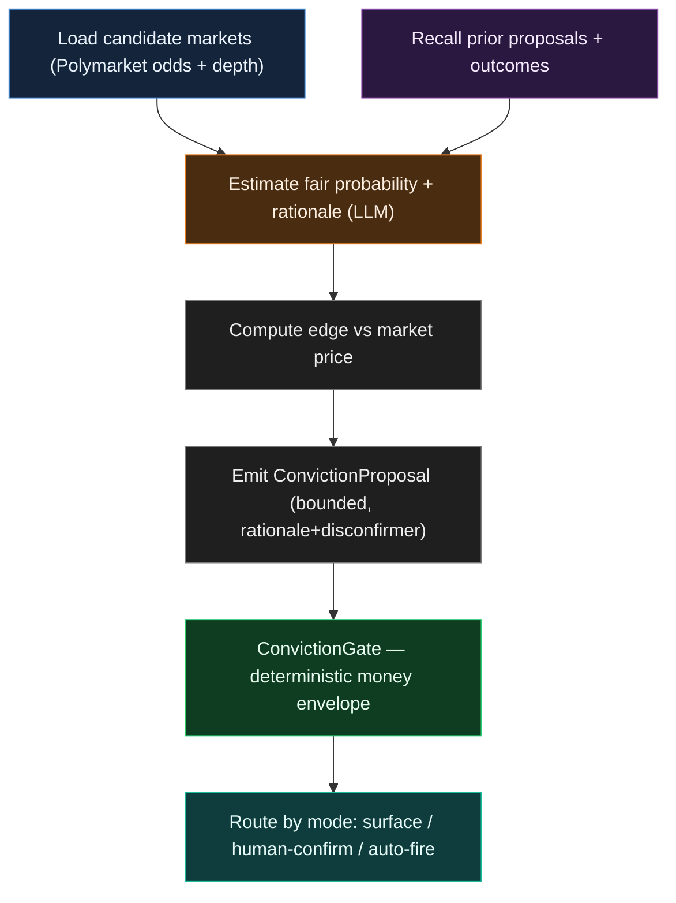
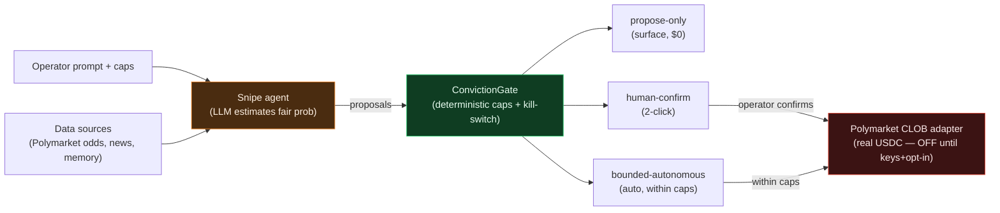

# Snipe lane — agent & pipeline

**Invariant:** the LLM (amber) only *estimates*; the deterministic `ConvictionGate` (green) is the only thing that authorizes money, and real USDC (red) stays OFF until keys + caps + opt-in.

## Agent node graph

## End-to-end pipeline

### Legend
- 🟧 **LLM** — the single node where a model reasons (estimates fair probability + rationale).
- 🟩 **Gate** — deterministic caps + kill-switch; disposes every money decision.
- 🟥 **Adapter** — real Polymarket execution; off until the operator wires keys + opts in.